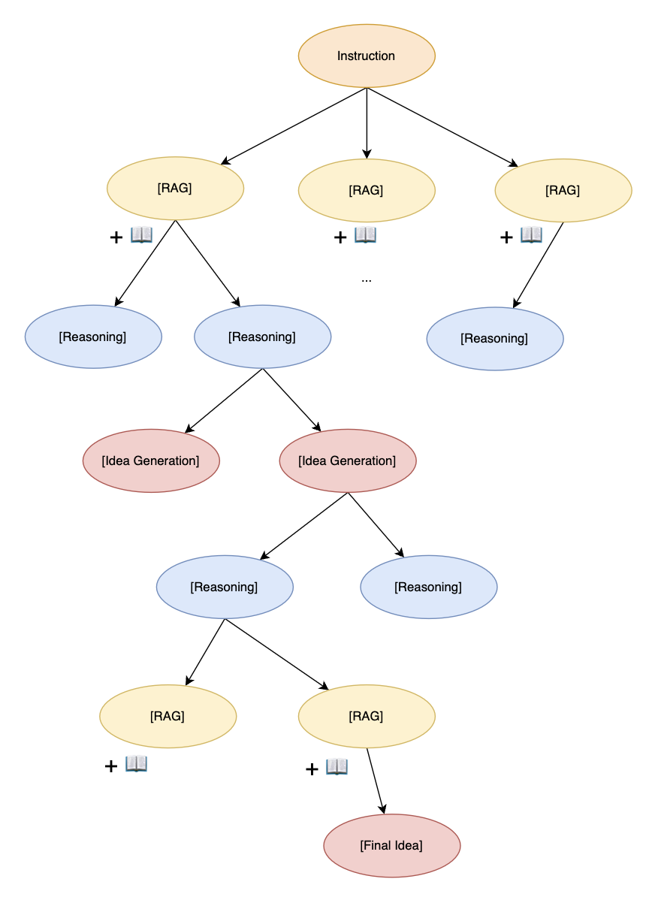

# IdeaNavigator: Integrating MCTS with Language Models for Scientific Idea Generation


**IdeaNavigator** is an advanced agent system specifically designed to integrate Monte Carlo Tree Search (MCTS) techniques, enabling the efficient generation and exploration of innovative scientific ideas.



#### Quick Start

```shell
python main.py --topic "your topic" \
--n_rollouts 10 \
--n_exp 4 \
--model "gpt-4o" \
--sampling_method "best"
```


#### Todo List

- [ ] Implementing RAG interface
- [ ] Benchmarking
